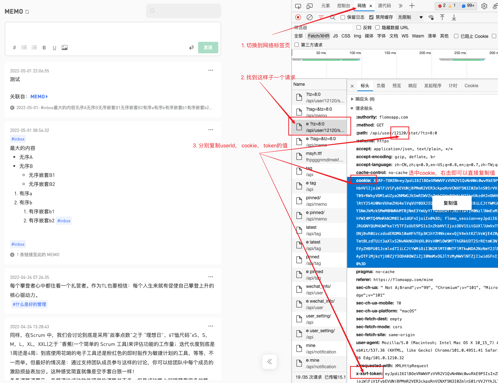

# sync-flomo-plugin

✨ 同步 flomo 笔记至本地 markdown。
因为现在没有使用 logseq 了，所以插件 [seyeeL/logseq-flomo-plugin: Sync flomo to logseq](https://github.com/seyeeL/logseq-flomo-plugin) 不再更新，改成使用 node 同步。

运行 `flomo_all` 是所有内容放在一页，运行 `flomo_date` 是按天同步。

[按步骤的教程](./doc/教程.md)

## 💡 常见问题

### 1. 如何获取授权信息（切换到 flomo 旧版)

1. 在你的浏览器登陆 flomo 账号后，按 F12 打开浏览器控制台后再次刷新 flomo 的页面（**强调：需要先调出控制台再刷新，字段肯定有的**）
2. 找到列表中为 tz=8:0 的接口，复制里面的 userId、cookie、x-xsrf-token 到脚本对应参数

