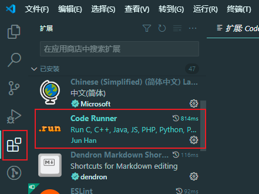
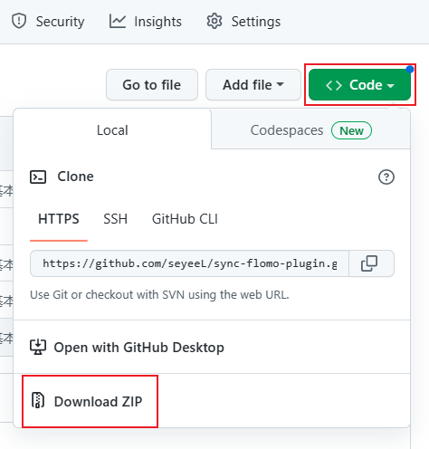
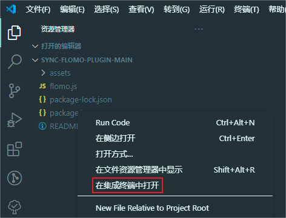
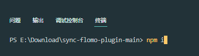
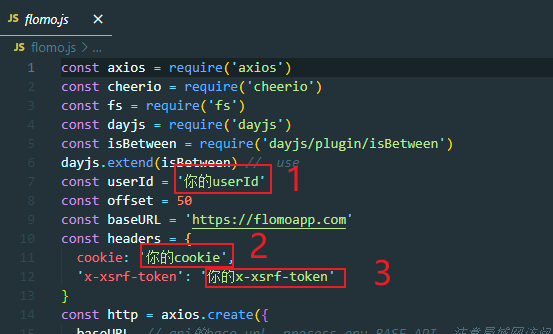
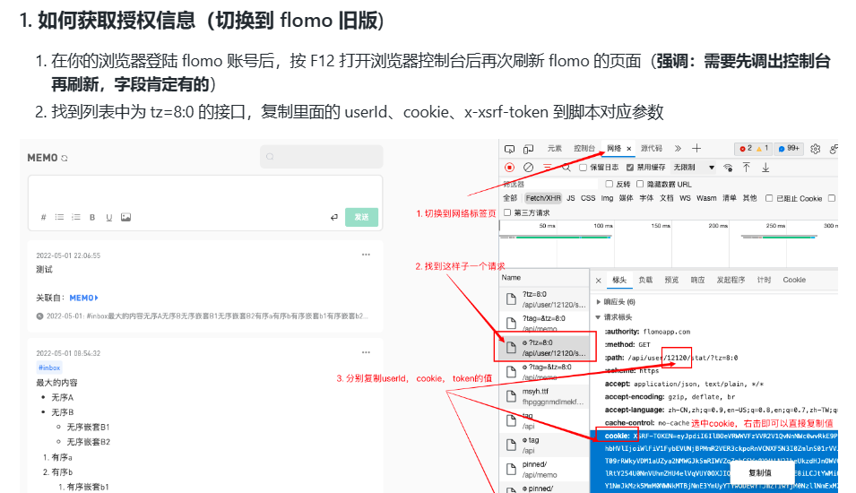
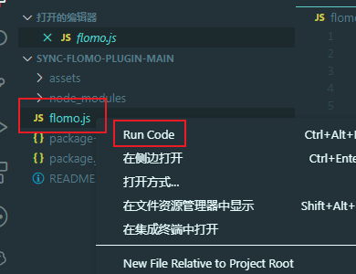

1. 安装 node
   [下载 | Node.js](https://nodejs.org/zh-cn/download/ )

2. 下载 vscode

    [Download Visual Studio Code - Mac, Linux, Windows](https://code.visualstudio.com/download )

3. 在 vscode 安装 code runner 插件

   

4. 下载脚本

   [seyeeL/sync-flomo-plugin](https://github.com/seyeeL/sync-flomo-plugin )
   
   

5. 用 vscode 打开解压后的文件夹，选择 package.json 右键，点击在终端中打开

    

6. 输入 `npm i`，按回车，等待安装完

    

7. 打开 flomo.js，修改这 3 个的值，修改后的值依然要有英文的引号，不要把引号删掉了。

   
   

8. 保存后右键 flomo.js，点击 Run Code，等待脚本运行结束。

   
